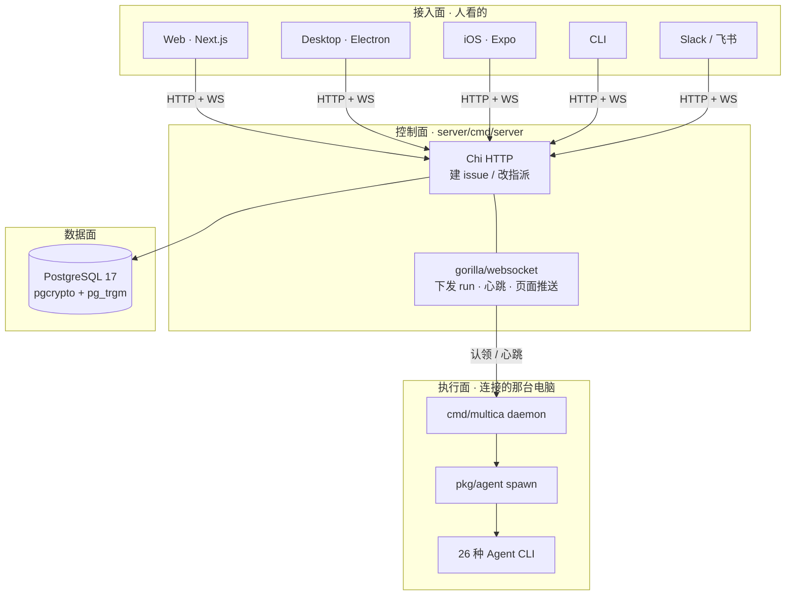
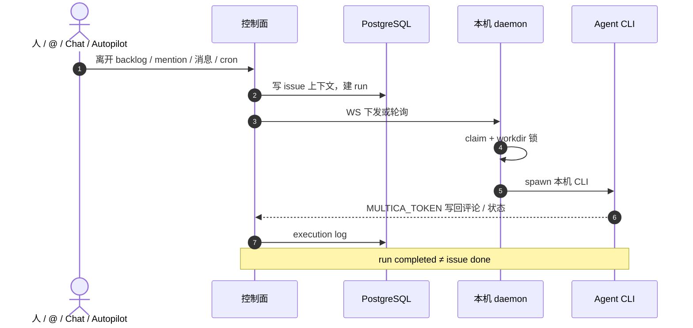
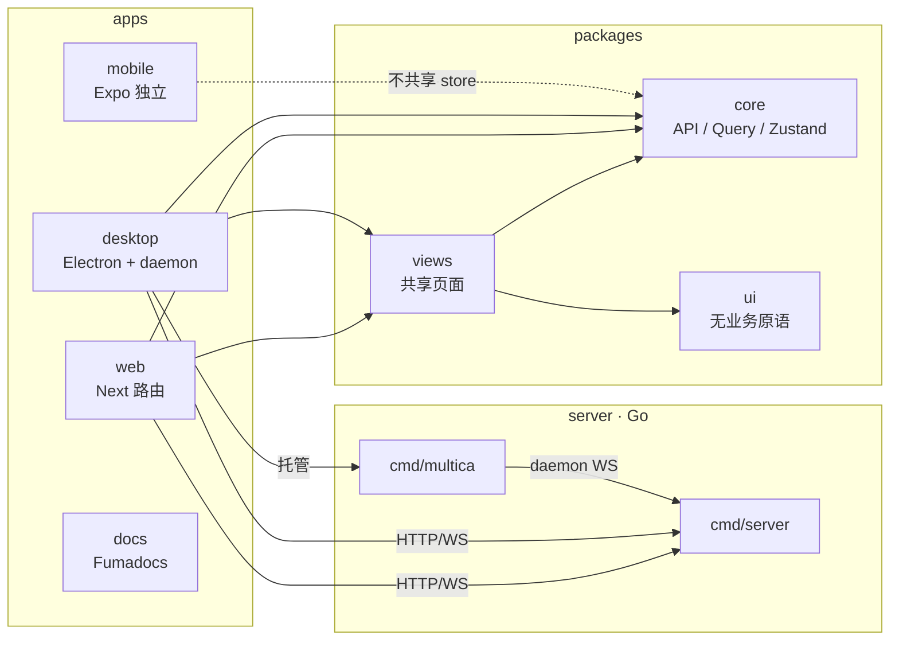
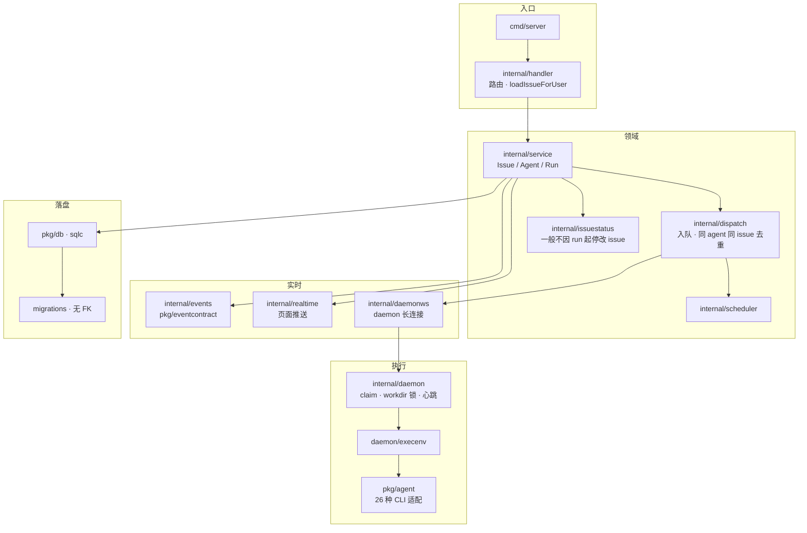
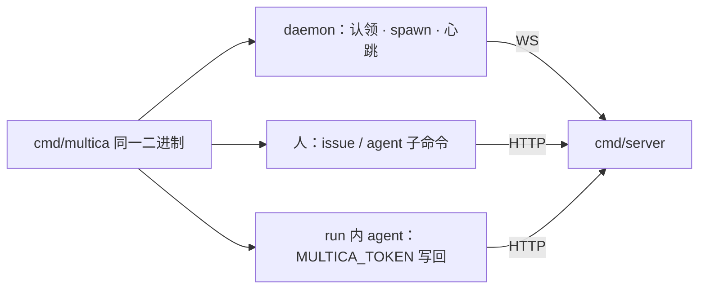
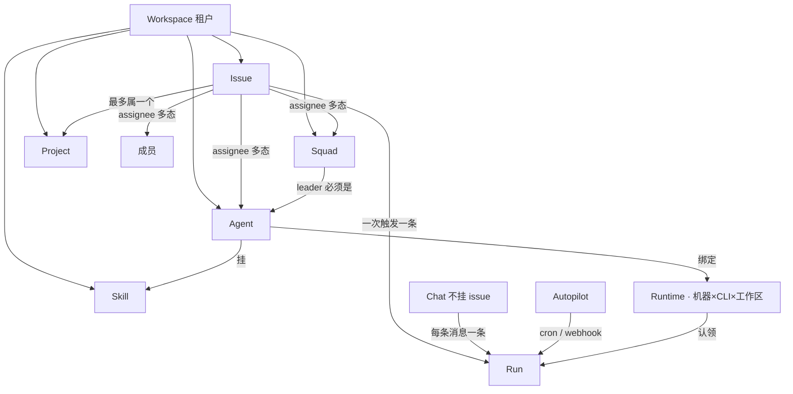
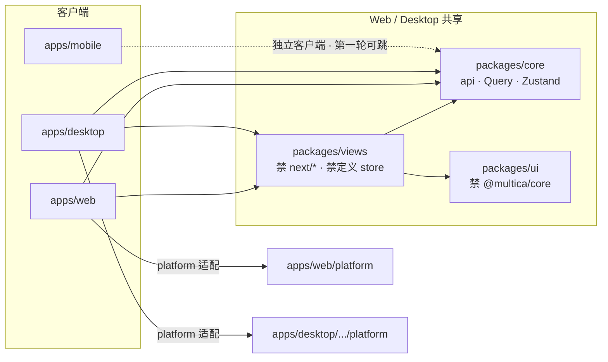

# Multica · 架构阅读大纲

> 按这份大纲看官方文档和源码，快速摸清 [multica-ai/multica](https://github.com/multica-ai/multica)。模式与 SDLC 对照仍读 [multica.md](./multica.md)；本页只负责「仓库怎么逛」。
>
> 整理日期：2026-09-21。依据：仓库 README / [AGENTS.md](https://github.com/multica-ai/multica/blob/main/AGENTS.md) / [VISION.md](https://github.com/multica-ai/multica/blob/main/VISION.md)、官方 docs（`apps/docs/content/docs/meta.json`）、GitHub 目录树。

**先把 Multica 当成看板 + 调度器，不要当成 Agent 框架。** 它不自带模型；驱动你机器上已装的 Claude Code、Codex、Cursor、`dsh` 等 CLI。服务器只存工单和排队；真正跑模型的是本机 daemon 去 spawn。代码、CLI 登录态、本地目录默认不出那台执行机。

读法：**先看本节两张总图，再按 §2 仓库 / §3 后端 / §4 领域 / §5 前端下钻。** 每节一张模块图，对照文内表格即可。

---

## 0. 一张图钉死边界

**先看这张。** 四层从上到下：人从接入面看看板；服务器只排队和存状态；真正改文件的永远在连接的那台电脑上。



**再看这张。** 四种触发汇成同一条路：建 run → runtime 认领 → 本机 spawn → 写回。Issue 完成默认是人签，不跟 run 结束绑死。



看完两张总图，按模块下钻：

| 想弄清 | 去 |
|---|---|
| 代码落在哪个仓、包怎么依赖 | [§2 仓库地图](#2-仓库地图) |
| handler → dispatch → daemon → spawn | [§3 后端黄金路径](#3-后端黄金路径) |
| Workspace / Issue / Agent / Run / Runtime | [§4 领域对象](#4-领域对象--代码落点) |
| Web / Desktop 共享层，store 在哪 | [§5 前端](#5-前端怎么扫) |

| 在 Multica 服务器 | 在连接的那台电脑 |
|---|---|
| workspace / issue / 评论 / 状态 | Claude、Codex、Cursor 等 CLI 和它们的登录 |
| agent 配置、skills | 源码目录、本地文件 |
| run 状态、execution log | 真正改文件、跑命令 |

例外：`custom_env` 存在服务器、执行时下发。密钥不要放这里。

**Issue 完成 ≠ run 完成。** run `completed` 只说这一趟 CLI 跑完；issue `done` 默认是人签。

---

## 1. 文档先过概念（半天内）

官方侧栏顺序就在仓库 `apps/docs/content/docs/meta.json`。中英选一套即可（`.zh.mdx`）。

**必读（按这个顺序，不要跳）：**

| # | 文档 | 带走的一句话 |
|---|---|---|
| 1 | [VISION.md](https://github.com/multica-ai/multica/blob/main/VISION.md) | 为什么做「人机同一块看板」 |
| 2 | [Core concepts](https://multica.ai/docs/concepts) · [中文](https://multica.ai/docs/zh/concepts) | 领域对象：Workspace / Issue / Agent / Runtime / Run / Squad / Skill / Project / Chat / Inbox / Autopilot |
| 3 | [How Multica works](https://multica.ai/docs/how-multica-works) | 一条 run 五步：issue 上下文 → 建 run → runtime 认领 → 本地 spawn → 写回 |
| 4 | [Triggering agents](https://multica.ai/docs/triggering-agents) | agent **不会自己开工**；四入口：指派 / `@` / Chat / Autopilot |
| 5 | [Squads](https://multica.ai/docs/squads) | Squad 只路由，不全员开工；先叫醒 leader |
| 6 | [Daemon and runtimes](https://multica.ai/docs/daemon-runtimes) | runtime = 机器 × 一种 CLI；心跳、离线、认领 |
| 7 | [Runs / Tasks](https://multica.ai/docs/tasks) | 队列、重试、取消、execution log |
| 8 | [Security model](https://multica.ai/docs/security-model) | 默认不沙箱 FS；隔离靠 OS 用户 / 容器 |

读完后对照 [multica.md](./multica.md) 的流程图和状态表。

**仓内给 agent 的地图（比 README 更准）：** [AGENTS.md](https://github.com/multica-ai/multica/blob/main/AGENTS.md) —— 包边界、sqlc、无 FK、assignee 多态。改代码前必读。

**可后置：** CLI 手册、频道集成、自托管 env、mobile。开发流程看 [CONTRIBUTING.md](https://github.com/multica-ai/multica/blob/main/CONTRIBUTING.md)。自托管看 [SELF_HOSTING.md](https://github.com/multica-ai/multica/blob/main/SELF_HOSTING.md)。CLI 与 daemon 关系看 [CLI_AND_DAEMON.md](https://github.com/multica-ai/multica/blob/main/CLI_AND_DAEMON.md)。

---

## 2. 仓库地图

pnpm monorepo + 独立 Go module。依赖方向：**`views → core + ui`；core 与 ui 互不引用。**



```
multica/
├── AGENTS.md, VISION.md, SELF_HOSTING.md, CLI_AND_DAEMON.md
├── apps/
│   ├── web/          Next.js 16 路由；框架 API 只留这里
│   ├── desktop/      Electron；托管本机 daemon
│   ├── mobile/       独立 Expo（另有 apps/mobile/AGENTS.md）
│   └── docs/         Fumadocs = 官网文档源
├── packages/
│   ├── core/         API client、TanStack Query、Zustand（无 UI、无 localStorage）
│   ├── ui/           无业务原语（禁 @multica/core）
│   ├── views/        Web/Desktop 共享页面（禁 next/*、禁定义 store）
│   └── plugin-sdk/
└── server/           Go · Chi · sqlc · gorilla/websocket
    ├── cmd/server    API 进程
    ├── cmd/multica   人与 agent 共用 CLI（含 daemon 子命令）
    ├── cmd/migrate
    ├── internal/     业务（勿从外部 import）
    ├── pkg/          可复用：agent 适配、db、protocol
    ├── migrations/   无 FK；索引 CONCURRENTLY
    └── sqlc.yaml
```

| 路径 | 职责 | 硬边界 |
|---|---|---|
| `apps/web` | Next.js 路由与 Web 专属 UI | 框架 API 留在这里；导航适配在 `apps/web/platform/` |
| `apps/desktop` | Electron；启动并托管本机 daemon | 导航走 desktop platform adapter |
| `apps/mobile` | 独立 Expo 客户端 | 不走 web/desktop 共享 store |
| `packages/views` | Web/Desktop 共享页面 | 禁 `next/*`、禁定义 store |
| `packages/core` | API client、Query、Zustand | 无 UI、无 `localStorage`；持久化走 `StorageAdapter` |
| `packages/ui` | 无业务的 UI 原语 | 禁 `@multica/core` |
| `server/cmd/server` | Go API 进程 | Chi + WS |
| `server/cmd/multica` | 人和 agent 共用的 CLI | run 内用 `MULTICA_TOKEN` 署名 |
| `server/pkg/agent` | 各 CLI 协议适配与 spawn | 默认测试不得碰用户已装 CLI |

前端状态纪律：

- 服务器数据走 TanStack Query；客户端草稿 / 筛选 / 弹窗走 Zustand。
- WebSocket 只 patch 或 invalidate Query，不把服务端 payload 塞进 Zustand。
- 只有 auth / workspace store 可以直接调 `api.*`；其它走 queries/mutations。
- workspace 级 query key 必须带 `wsId`。
- JSON 经 zod + `parseWithFallback`，不用 `as T`（桌面客户端可能对新后端）。

---

## 3. 后端黄金路径

一条指派如何变成本机 CLI。clone 后按调用链往下点，不要按字母扫 `handler/`。



跟这条链时盯这些入口：

| 现象 | 优先打开 |
|---|---|
| 指派 / 离开 backlog 才入队 | `handler` 里 issue 更新 + `server/cmd/multica/cmd_issue_wakeup.go` |
| `@` mention 唤醒 | comment 解析；规范 mention 是 `mention://agent/<uuid>`，不是裸 `@Name` |
| Squad 只叫醒 leader | squad 指派逻辑，不要先看 UI |
| runtime 认领、防双跑 | `internal/daemon/client.go`（有 `batch_claim` 测试） |
| workdir 被占 | run 状态 `waiting_local_directory` |
| spawn Claude / Codex / Cursor | `pkg/agent` + `daemon/execenv` |
| 失败重试 / 不重试鉴权额度 | `pkg/taskfailure`、[tasks](https://multica.ai/docs/tasks) |
| 心跳约 15s、异常退出后约 3 分钟标离线 | `daemonws` / daemon heartbeat |

CLI 与 daemon 是**同一个二进制** `server/cmd/multica`：`cmd_daemon.go`、`cmd_issue.go`、`cmd_agent.go`。agent 在 run 里用 `MULTICA_TOKEN` 调同一套 CLI 写回 issue。`MULTICA_TOKEN` 最长 24h；子进程默认继承。盖不掉的环境变量还有 `MULTICA_TASK_ID`、`MULTICA_AGENT_ID`、`MULTICA_WORKSPACE_ID`、`MULTICA_SERVER_URL`。



并发：daemon 默认最多 20 条 run，每个 agent 最多 6，取较小值。

---

## 4. 领域对象 → 代码落点

Workspace 是容器。Issue 是工作真相。Agent 是配置不是常驻进程。一次触发才产生一条 Run，由 Runtime 认领。Squad 只叫醒 leader。



| 对象 | 先看后端 | 要点 |
|---|---|---|
| Workspace | `handler` + `service`；请求头 `X-Workspace-ID` | 租户边界。角色 `owner` / `admin` / `member`。Agent 另有 Access，不跟角色走 |
| Issue | issue service；`assignee_id` + `assignee_type` | 工作真相。指派人可以是成员、agent 或 squad。`backlog` 只停车 |
| Agent | 配置，不是常驻进程 | 被指派或 `@` 才会跑 |
| Runtime | daemon 注册 | 一台电脑 × 一种 CLI × 一个工作区 = 一条 runtime。心跳判定在线 |
| Run | dispatch + daemon claim | 一条触发对应一条 run。`completed` ≠ issue 完成 |
| Squad | leader 必须是 agent | 指派 squad ≠ fan-out |
| Skill | `internal/skill`、`pkg/skillbundle` | `SKILL.md`；Instructions = 这个人是谁，skill = 这类活怎么做 |
| Autopilot | `handler` + `cmd_autopilot.go` | cron / webhook / 手动 |
| Chat | 不挂 issue | 每条消息一条 run |
| Inbox | 只打扰人 | agent 不用 Inbox |
| Project | issue 最多属一个 project | 子 issue 状态互不影响；可按 stage 分批叫醒父 assignee |

数据库硬规则（AGENTS.md）：

- **不要加 FK / CASCADE**；关系在应用层事务里清。
- 每个新建索引用 `CREATE [UNIQUE] INDEX CONCURRENTLY`，单独一个 migration 文件。
- UUID 写入前用 `loadIssueForUser` / `loadAgentForUser` 这类 loader，不要信 URL 字符串。
- workspace 级查询必须带 `workspace_id`；成员资格把门。

Issue / Run 状态对照见 [multica.md](./multica.md)「领域对象」节。

---

## 5. 前端怎么扫

服务器数据走 TanStack Query；草稿 / 筛选 / 弹窗走 Zustand。WebSocket 只 patch 或 invalidate Query，不把服务端 payload 塞进 Zustand。



架构需要，实现细节可跳：

1. `packages/core/api/` + `schema.ts`
2. `packages/core` 里 Query keys（workspace 级必须带 `wsId`）
3. `packages/views/layout/` 的 `DashboardGuard`
4. `apps/web/platform/` vs `apps/desktop/.../platform/` —— 导航适配器
5. **不要从 `packages/views` 找 store 定义**，没有

Mobile 是独立客户端，第一轮可整包跳过。

---

## 6. 建议阅读日程

| 段 | 时长 | 读什么 | 带着的问题 |
|---|---|---|---|
| 1 概念 | ~2h | VISION → concepts → how-multica-works → triggering → squads → 对照 [multica.md](./multica.md) | 谁是工作真相？谁真正执行？ |
| 2 控制面 | 半天 | AGENTS.md → `cmd/server` 路由 → `handler` issue/comment → `service` → `dispatch` | 谁创建 run？谁禁止双 queued？ |
| 3 执行面 | 半天 | `cmd/multica` daemon → `internal/daemon` → `pkg/agent` 里选一个熟 CLI | claim 失败怎么办？workdir 锁在哪？ |
| 4 按需 | — | Git/VCS、频道、Autopilot、skills 打包、自托管 | 插件面，不是内核 |

clone 后确认结构：根目录 `make dev`（见 CONTRIBUTING）。改 SQL 后 `make sqlc`。Worktree 共享 PostgreSQL 但库和端口隔离，不要抄主 checkout 的 `.env`。

---

## 7. 第一周刻意不看

- `server/cmd/backfill_*`、各种 `*backfill` 包
- `apps/mobile/`
- 26 个 CLI 适配器逐个读（掌握 1 个适配模式即可）
- `packages/ui` 组件实现
- analytics / entitlement / seatcapacity（云产品计费）

默认测试**禁止**解析用户已装 CLI；真机冒烟要 `MULTICA_RUN_REAL_AGENT_SMOKE=1` 和 `agentintegration` tag。

读代码时从 **issue 指派 → dispatch → daemon claim → pkg/agent spawn** 这一条贯穿，比按目录字母顺序快一个数量级。
